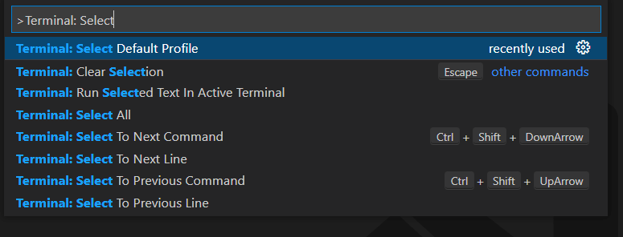
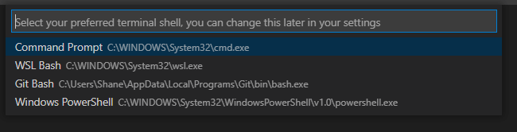
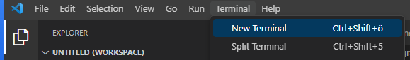
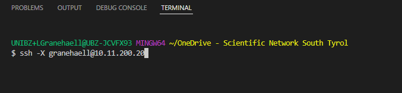
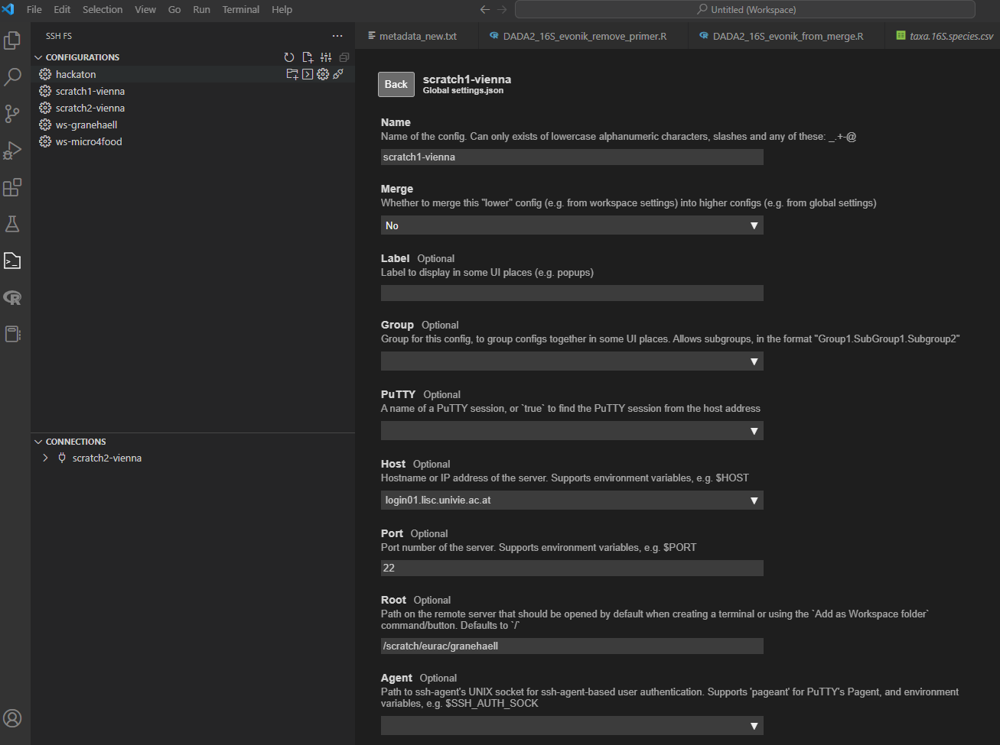
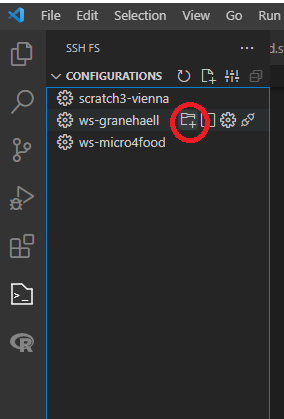
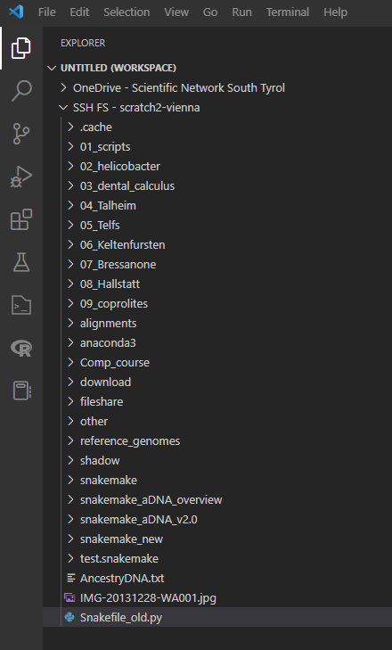
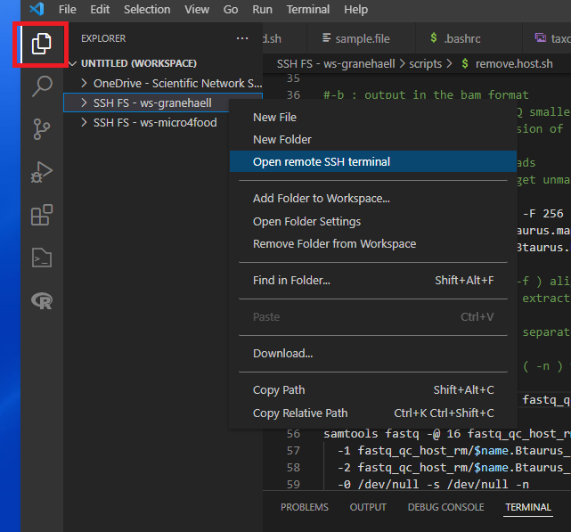
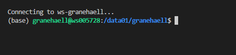
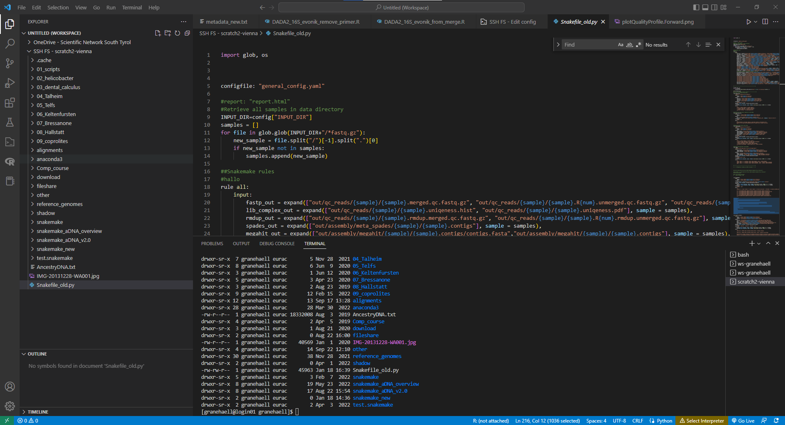

# Visual studio code tutorial

### 1) Download VScode
https://code.visualstudio.com/
### 2) Install git bash 
you also need the program to be able to read shell bash files, which is the programming language for linux.  
**https://git-scm.com/downloads** 

Select bash as your default language:  
    1) Open Visual Studio Code 
    2) Press CTRL + SHIFT + P to open the Command Palette 
    3) Search for “Terminal: Select Default Profile” (previously “Terminal: Select Default Shell”) 
    4) Select “Git Bash” as your preferred shell  

### 3) Log in via terminal
You can open a simple terminal like this and then log in :

### 4) Install the extension ssh FS 
This extension  makes it possible to acces the workstation in a folder format similar to a windows setup. It also makes it easy to open files on the server in an editor. It connects to the workstation via a ssh connection.  
https://marketplace.visualstudio.com/items?itemName=Kelvin.vscode-sshfs   

Make a new configuration for the connection to the workstation in ssh FS. 

"Name": what you want the connection to be called. Can be anything eg. "Vienna server” or your username 
Click save

On the next page, fill in these fields: 
“Host”: type in the IP address the Vienna server: **login0X.....at** (I didn't want to write the full thing here)  
“root” this is which directory you want to connect to and use as root directory when you log ing. Eg `/scratch/eurac/$username` or `/scratch/eurac/Common`  
“username”. your username  
“password” – choose prompt. You will have to type it in every time you want to log in. It is not recommended to put the password in this configuration, as it is not very safe.  
Click save

)

4.	Log in 

### Log in via ssh fs to access folder 
In SSH FS, right click on the configured connection (upper left corner) and select **Add as workspace folder** 

At prompt, put in password 	

Now you should have your folders on the left side  	

Now you can open any file you want from the server and edit it as a normal file (eg, ctrl+F to search, ctrl+S to save). 

You can also open the terminal by right clicking on the Workspace folder and click on **“open remote SSH terminal”**. 

It will not require a password prompt, since you already typed it in when you logged in to workspace folder. It should have started a terminal directly in the root folder you chose `/scratch/eurac/$USER`  	

### Finished editor 

